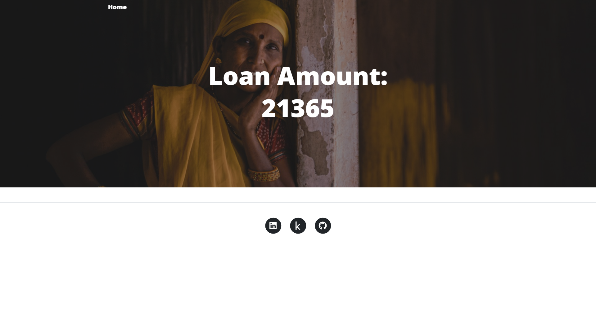

Photo by <a href="https://unsplash.com/@tomcchen?utm_content=creditCopyText&utm_medium=referral&utm_source=unsplash">Tom Chen</a> on <a href="https://unsplash.com/photos/woman-leaning-on-wall-jO1OyKR7s68?utm_content=creditCopyText&utm_medium=referral&utm_source=unsplash">Unsplash</a>

# What is RuralCredit?
<p>RuralCredit is a financial service provided to individuals and businesses in rural areas. It provides loan that help support agricultural activities, rural development, and livelihoods in rural communities.</p>
<p>RuralCredit plays a crucial role in empowering farmers, small businesses, and rural entrepreneurs by providing them with the necessary funds to invest in their operations, purchase equipment, and improve their productivity. It helps bridge the gap between the financial needs of rural communities and the availability of financial resources.</p>
<p>By facilitating access to credit, rural credit contributes to the overall economic growth and development of rural areas, reduces poverty, and enhances the standard of living for rural populations.</p>

------------------------------------------------------------------------------------------------------------------------

## Working Screenshots:




------------------------------------------------------------------------------------------------------------------------
## Setting Up the Project:
1. Clone the repository
2. Create a virtual environment using setup.sh:
    ```
    bash setup.sh 
    ```
3. Activate the virtual environment (optional, if not done in step 2)
    ```
    source activate ./venv
    ``` 
------------------------------------------------------------------------------------------------------------------------

## Workflow:
1. Update config: `config/config.yaml`
2. Update raw/processed data schema: `raw_schema.yaml/processed_schema.yaml` (if needed)
3. Update model parameters: `params.yaml` (if needed)
4. Update the entity: `src/RuralCreditPredictor/entity/config_entity.py`
5. Update the configuration manager: `src/RuralCreditPredictor/config/configuration.py`
6. Update the components: `src/RuralCreditPredictor/components`
7. Update the pipeline: `src/RuralCreditPredictor/pipeline`
8. Update entrypoint: `main.py`
9. Update application: `app.py`

------------------------------------------------------------------------------------------------------------------------

## MLFlow Setup:
Commands to set up the MLFlow environment:
1. MLFlow Tracking URI:
   ```
   export MLFLOW_TRACKING_URI=https://dagshub.com/heydido/RuralCreditPredictor.mlflow
   ```
2. MLFlow Tracking Username:
   ```
   export MLFLOW_TRACKING_USERNAME=heydido
   ```
3. MLFlow Tracking Password:
   ```
    export MLFLOW_TRACKING_PASSWORD=********
    ```
Get these from the DAGsHub server.

------------------------------------------------------------------------------------------------------------------------

## DVC Setup:
Commands to set up the DVC environment:

1. Initialize DVC:
   ```
   dvc init
   ```
2. Write the DVC file: `dvc.yaml`

3. Run the DVC pipeline:
   ```
   dvc repro
   ```
   `Note:` "dvc repro" will fail if you have exported the MLFlow variables as explained in the MLFlow Setup section. 

4. Track each experiment changes with git:
    ```
    git add .
    git commit -m "DVC: <message>"
    git push origin main
    ```
5. Add DVC Remote (one-time):
    ```
    dvc remote add origin s3://dvc
   dvc remote modify origin endpointurl https://dagshub.com/heydido/RuralCreditPredictor.s3
    ```
6. Push the DVC changes:
    ```
    dvc push
    ```
   
## DVC DAG:


------------------------------------------------------------------------------------------------------------------------

## Complete Data Pipeline:


DAGsHub: [RuralCreditPredictor](https://dagshub.com/heydido/RuralCreditPredictor)

------------------------------------------------------------------------------------------------------------------------
Owner: [Aashish Jaiswal](https://www.linktr.ee/heydido)
------------------------------------------------------------------------------------------------------------------------

This project is created using a public template I created: [MLProjectTemplate](https://github.com/heydido/MLProjectTemplate)
